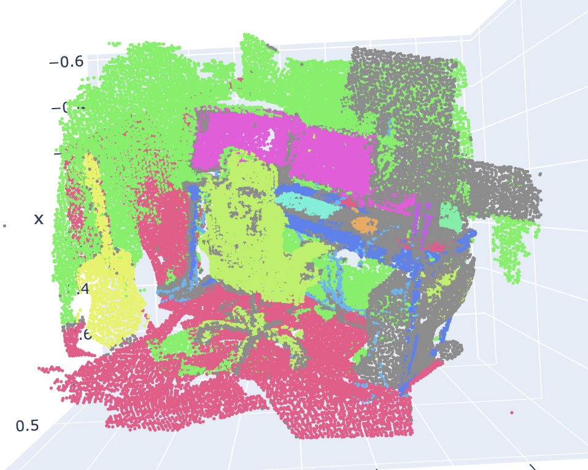
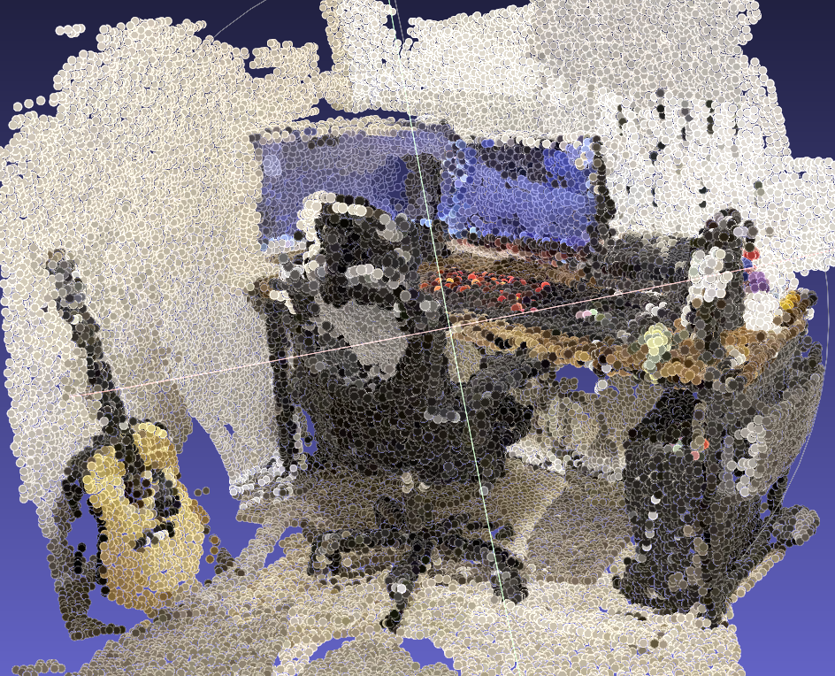
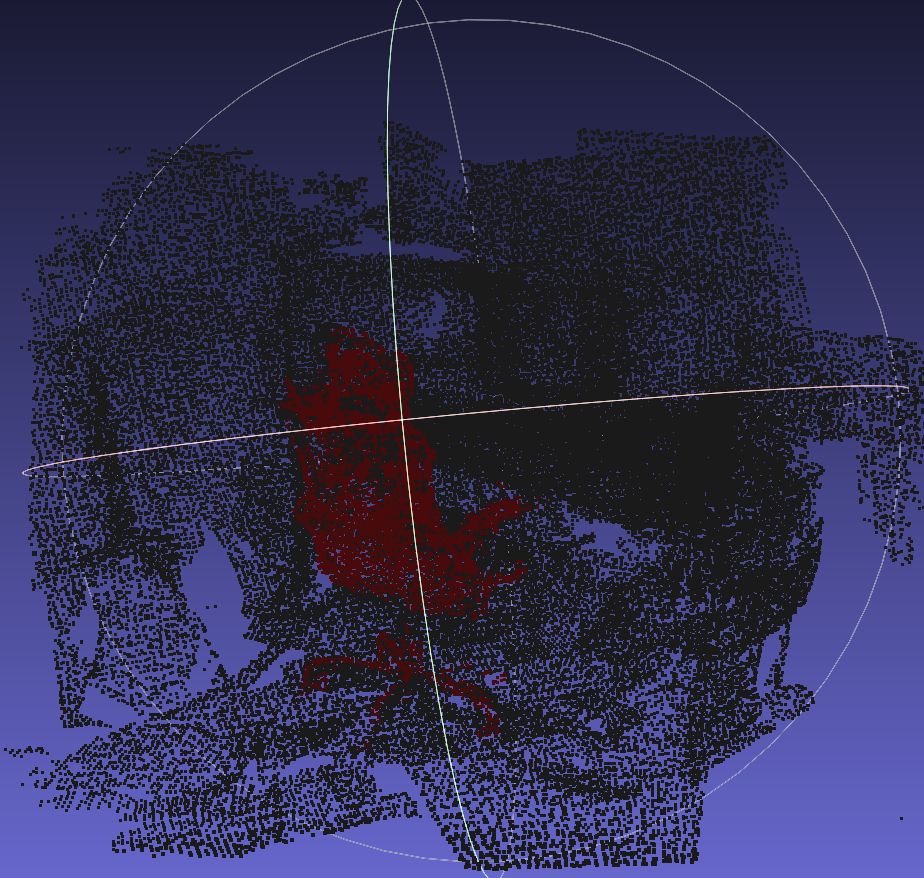
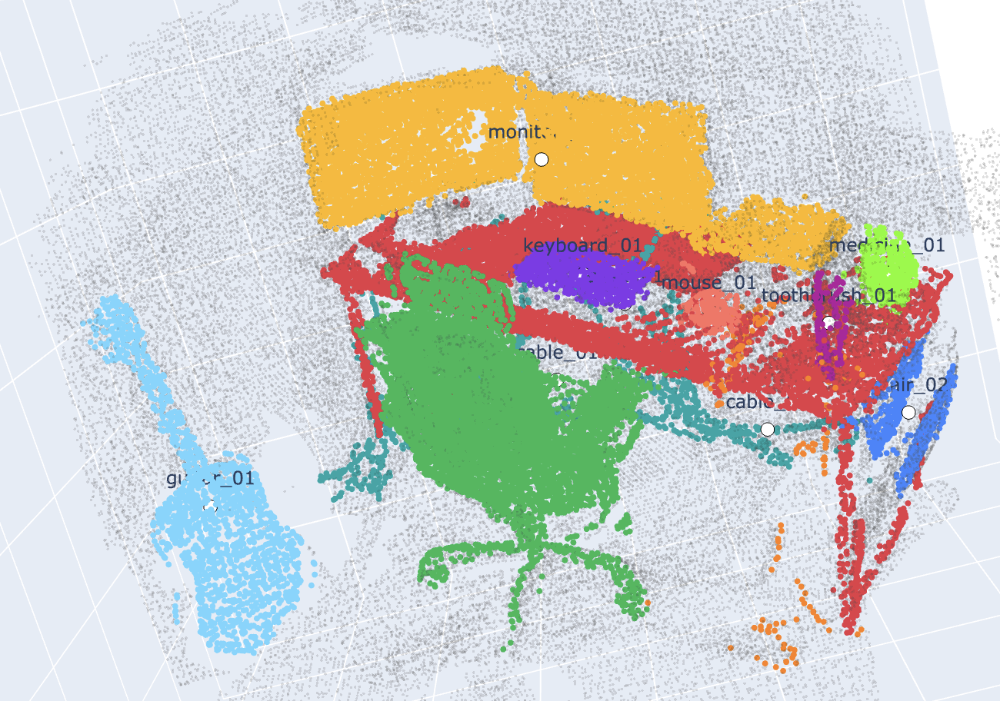
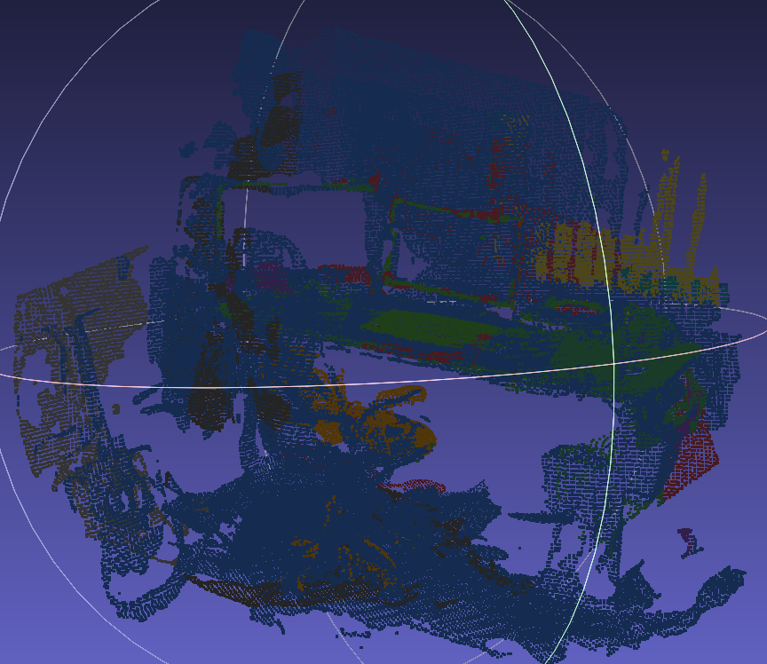
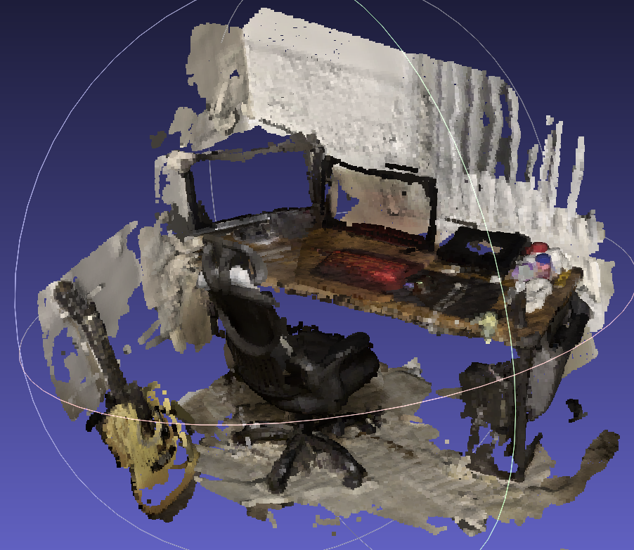
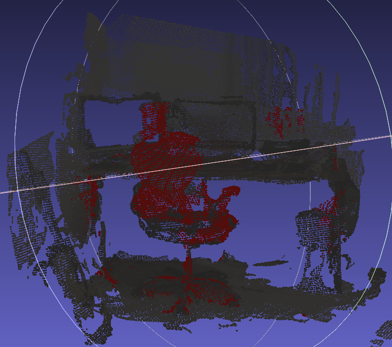

# Video-to-3D-Reconstruction

Phone video to a queryable 3D scene using Meta **VGGT-Omega** for geometry and **SAM 3** for open-vocabulary semantics.

Given a video of an indoor area, the system produces a geometrically coherrent 3D point cloud, semantic labels per point, and open-vocabulary text querying that highlights matching 3D regions. It also features a semantic reasoning primitive that clusters the scene into object instances, estimates their 3D properties, and answers affordance style questions.

Every semantic label is sampled from the exact pixel that produced its 3D point, so labels cannot drift relative to the underlying geometry.

## Semantic Reasoning Primitive

The main approach is a **spatial memory layer** built on top of the reconstruction. Ex:

```bash
python -m spatial_recon.query_scene --run runs/desk
```

```text
Q: Where can a robot place a cup?
A: desk_01

Q: Find a place where a human could sit.
A: chair_01, chair_02

Q: Which objects are likely movable?
A: chair_01, chair_02, keyboard_01, mouse_01, guitar_01
```

The point of this layer is to make the reconstruction inspectable for robtics. Objects have positions, sizes, confidence scores, relationships, and affordances that can be verified visually in 3D.

## Output Examples for VGGT-Omega

| Semantic point cloud | Poisson Disk Sampling | Open-vocabulary `chair` query |
| --- | --- | --- |
|  |  |  |
| Fused cloud colored by SAM 3 concept ID | Poisson Disk Sampling over the same points | Highest scoring matches for the prompt `chair` highlighted in red |

### Spatial Memory Examples

| Object instance viewer |
| --- |
|  |
| Colored object clusters with centroid labels from `memory_instances.html` |


## Install

```bash
git clone https://github.com/ayushmaankaria/Video-to-3D-Reconstruction.git
cd Video-to-3D-Reconstruction
pip install -r requirements-colab.txt
```

VGGT-Omega and SAM 3 are gated. Request access on Hugging Face, generate a read token, and authenticate (`hf auth login`) before running.

## Recording Tips

- Walk at normal or slightly slow pace; avoid sudden motion.
- Translate and rotate, pure rotation gives VGGT-Omega weaker geometry.
- Keep the scene static and avoid letting reflective screens dominate the frame.
- Capture overlapping views of object boundaries: chair legs, desk edges, monitors, walls, floor.

## Example Run

```bash
python -m spatial_recon.cli run \
  --video "/content/drive/MyDrive/desk_video.mp4" \
  --out runs/desk \
  --checkpoint checkpoints/vggt-omega-1b-512/model.pt \
  --image-resolution 512 \
  --max-frames 48 --fps 2.0 \
  --concepts "desk,chair,monitor,keyboard,mouse,cup,wall,floor,cable,guitar,toothbrush,medicine,watch" \
  --conf-percentile 30 --sample-stride 2 --voxel-size 0.01
```

Open `runs/desk/exports/viewer.html`, or load the `.ply` outputs in MeshLab.

### Open-vocabulary query

```bash
python -m spatial_recon.cli query \
  --run runs/desk \
  --text "monitor" \
  --topk-percent 8 \
  --score-threshold 0.5
```

Writes `runs/desk/exports/query_monitor.ply` with the top-scoring matches painted red.

### Build robot spatial memory

After the main reconstruction has produced `runs/desk/exports/fused_points.npz` and `runs/desk/semantics/labels.json`,

```bash
python -m spatial_recon.memory \
  --run runs/desk \
  --eps 0.15 \
  --min-samples 20
```

Then query it:

```bash
python -m spatial_recon.query_scene --run runs/desk
```

This writes `scene_memory.json`, `memory_instances.ply`, and `memory_instances.html`. The HTML view is the easiest way to check whether answers such as `desk_01` or `chair_01` correspond to real object-shaped clusters in the reconstruction.

## Outputs

```text
runs/desk/
  frames/                         # sampled frames
  frames_meta.json
  predictions.npz                 # VGGT-Omega depth, cameras, confidence, points
  semantics/
    label_maps/*.npy              # per-frame SAM 3 semantic label maps
    previews/*.png
    labels.json                   # concept ↔ id map
  exports/
    reconstruction_rgb.ply        # geometry colored by RGB
    reconstruction_semantic.ply   # geometry colored by concept
    reconstruction_semantic.glb   # point-cloud GLB
    viewer.html                   # interactive cloud + camera path
    semantic_legend.json
    fused_points.npz              # points, labels, confidence, source pixels
    query_<text>.ply              # written by the query subcommand
    scene_memory.json             # object instances, 3D properties, affordances, relations
    memory_instances.ply          # colored object-cluster verification cloud
    memory_instances.html         # interactive object-instance viewer with centroid labels
  REPORT.md                       # quality stats and design notes
```

## Results & Runtime

A handheld iPhone 16 Pro clip (4K, 60 fps) of a desk area, processed end-to-end on a single **NVIDIA L4** in **~8 minutes**:

| Metric | Value |
| --- | --- |
| Frames sampled | 48 |
| Fused points (after voxel filtering, 1 cm voxels) | ~90.5k |
| Semantic classes present | 12 |
| Mean / median VGGT-Omega confidence | 6.58 / 6.34 |
| Scene extent (bbox) | ~1.34 m × 1.59 m × 1.10 m |


## Original VGGT/Mask2Former Output Examples
| Semantic point cloud | Poisson Disk Sampling |`chair` query |
| --- | --- | --- |
|  |  |  |


## Design Choices

- **VGGT-Omega over plain VGGT and COLMAP/SfM + MVS** I first ran the baseline VGGT model and got usable but subpar geometry on desk scene. VGGT-Omega (released May 18, 2026 by Meta) gave noticeably cleaner depth and more consistent cameras, and avoided the matching-failure modes of classical SfM on textureless office surfaces.
- **SAM 3 over Mask2Former** SAM 3 produces cleaner instance-level masks for indoor concepts and lets us use the exact same text prompts for both reconstruction and querying.
- **Pixel-aligned semantics** Sampled SAM 3 labels at the exact pixels used for 3D unprojection. Geometry and semantics share a coordinate system by construction.
- **Voxel fusion** A simple confidence-weighted majority vote keeps things fast while preserving the source pixel provenance for downstream queries.
- **Spatial memory** The project intentionally goes beyond reconstruction by clustering semantic points into object entities, turning the output into something closer to a robot's working map than a static visualization.


## Limitations
- Reflective surfaces such as the side of the guitar are noisy and partially missing, as expected from view-dependent reflections. Floor and walls show mild deformation, likely a function of recording style.
- SAM 3 masks are prompt-dependent. Unlisted objects fall into the "unkown" category.
- Limited GPU usage in Colab. (Note: I'm excited to work in industry where I can utilize more compute rather than T4/L4s in Colab)

## Future Work
- Transitioning to affordances learned from interaction data, rather than rule-based affordances, would make the system much more robust fo real-world robotics.
- Open-vocabulary querying re-runs SAM 3 per query, so distilling dense per-frame features into per-point 3D embeddings would allow for instant queries/faster runtime.
- Adding a 3D Gaussian Splatting visualization path would produce a more photorealistic output.


## References

- VGGT-Omega: https://github.com/facebookresearch/vggt-omega · https://huggingface.co/facebook/vggt-omega
- SAM 3: https://github.com/facebookresearch/sam3 · https://huggingface.co/facebook/sam3
